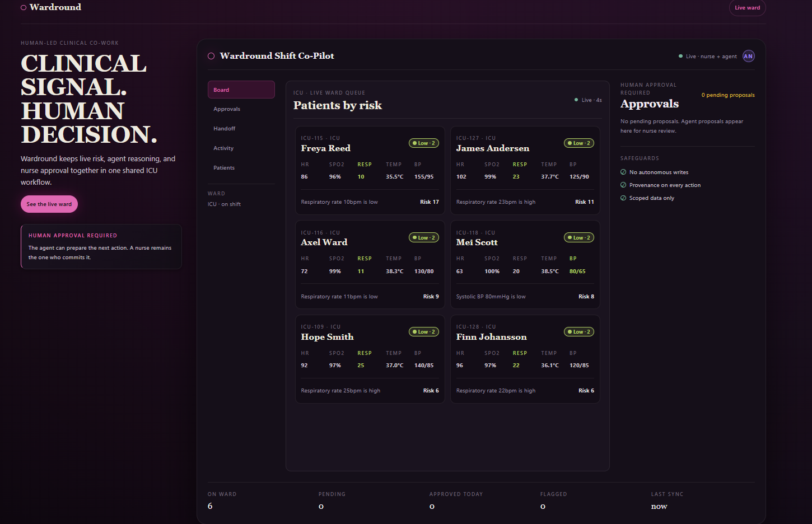

# Wardround

Wardround is a simulated ICU shift-handoff and triage co-pilot built with React and WebMCP. A nurse and an AI agent work the **same live patient board**: the agent reads scoped clinical context, proposes workflow changes, and drafts the shared shift handoff — but **every write is human-approval-gated**, and every agent action carries visible provenance. The agent proposes; the nurse decides.

**Deployed app:** https://pulsecheck.pages.dev



## How to test in ChatGPT

Wardround exposes its actions to an in-browser agent through WebMCP (`document.modelContext`). To exercise the tools, **open the deployed URL inside ChatGPT's in-app browser** — that is the environment where the page's WebMCP tools are discoverable and callable. Loading it in an ordinary browser tab renders the board but does not give an agent tool access.

1. Open https://pulsecheck.pages.dev in ChatGPT's in-app browser.
2. The page registers its seven tools on `document.modelContext`.
3. Ask the agent one of the prompts below. When it proposes a change, approve or reject it in the Approvals view.

### Three reliable prompts

1. "List the ICU patients by clinical risk and tell me who is most critical."
2. "Using the patient you identified as currently highest risk, propose an urgent flag for nurse review. Use their live top concern as the reason. Create only a pending proposal." — the agent creates a proposal and **stops**; you approve it in Wardround.
3. "Draft a shift handoff summary for the ICU ward." — the draft appears in the Handoff view for you to edit inline.

## WebMCP tools

Seven tools, grouped by role:

- **Read (scoped, no state change):** `list_patients_by_risk`, `explain_risk`
- **Proposal writes (create a pending proposal, nurse-approved):** `flag_patient`, `annotate_patient`, `acknowledge_alert`, `propose_triage_order`
- **Shared document:** `draft_handoff_summary`

### Human-approval model

- Read tools return scoped fields only and never mutate state.
- Every proposal write pushes a **pending proposal** with a clinical provenance reason into the Approvals rail. It never commits directly. Only a nurse's approval changes patient workflow or the manual triage order; rejection discards it. Both outcomes are recorded in the audit log. `acknowledge_alert` is never autonomous.
- `draft_handoff_summary` is the one narrow, auditable exception: it writes only the shared handoff draft (marked agent-authored) and its audit entry — never patients, proposals, approvals, alerts, or triage state. A nurse can edit and save that draft inline.

## Architecture

- **Client-side React + Zustand.** A single Zustand store is the one source of truth; both the UI and the tools read and write through it. There is **no backend and no database**.
- **Tools contain no UI.** Each tool's `execute` validates its input against the live store snapshot and calls a store action. Registration happens once on mount via `document.modelContext.registerTool` inside a `useEffect` with `AbortController` cleanup.
- **Simulated live-vitals feed.** A 4-second feed drifts each patient's vitals; risk is scored against `map_alert_thresholds.json` and the board re-ranks continuously.

## Security & trust

- Wardround uses **synthetic demo data only. It is not for clinical use** and contains no real patients.
- Tools register on `document.modelContext` (never the deprecated `navigator.modelContext`) and read live client-side state at execution time.
- Read tools return scoped data only and set both `readOnlyHint` and `untrustedContentHint`. Tool descriptions are static and never interpolate agent- or user-supplied text.
- No autonomous writes: every clinical change is a pending proposal that takes effect only after nurse approval, and every proposal and decision is audited.

## New in this hackathon vs. inherited

- **New this hackathon (built in this window):** the entire client-side React application, the seven-tool WebMCP layer, the approval queue, provenance chips, the shared handoff pane, the audit log, the simulated vitals feed, the risk-scoring logic, and the `?demo=1` recording mode.
- **Inherited / pre-existing:** the synthetic PulseCheck dataset (`bulk_vitals.json`, the `map_*` files) and the visual design aesthetic (rose/plum palette, Playfair Display headings, glassmorphic cards).
- **Not carried over:** the original PulseCheck FastAPI/Jinja2 backend and its Azure/Databricks data pipeline are out of scope for this build.

## Local development

```bash
npm install
npm run dev
```

Validation:

```bash
npm run lint
npm run build
```

### Recording mode (`?demo=1`)

Opening the app with `?demo=1` (e.g. `https://pulsecheck.pages.dev/?demo=1`) enables a deterministic recording mode: the seeded ICU patient **Freya Reed (bed ICU-115)** follows a fixed downward SpO2 trajectory and deteriorates to **Critical** through the normal threshold and scoring pipeline in roughly 16 seconds. This affects only that one patient's simulated vitals; scoring, tools, approvals, audit, and the handoff are unchanged. Without `?demo=1`, the feed behaves normally.

## License

Released under the [MIT License](LICENSE).
